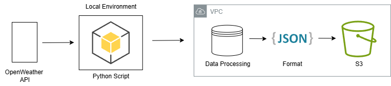

# Weather Dashboard with Python, OpenWeather API, and AWS S3

## Introduction

In this project, we'll build a weather dashboard that uses the OpenWeather API to fetch real-time weather data and store it in AWS S3. This solution provides a way to track weather conditions across multiple cities while maintaining historical data.



## Getting Started

### AWS Configuration

1. Create an AWS account if you don't have one
2. Create an IAM user with S3 access
3. Generate access keys
4. Ensure your IAM user has appropriate S3 permissions:
   - s3:CreateBucket
   - s3:PutObject
   - s3:GetObject
   - s3:ListBucket
5. Configure AWS CLI on your terminal
   [For more information visit AWS documentation](https://docs.aws.amazon.com/cli/latest/userguide/getting-started-quickstart.html)

### Clone this Repository

```bash
git clone https://github.com/inimukmin/weather-dashboard
cd weather-dashboard
```

### Set Up Virtual Environment

```bash
python -m venv venv
source venv/bin/activate  # On Windows, use: venv\Scripts\activate
```

### Install Dependencies

The `requirements.txt` should contain:

```
boto3==1.26.137
python-dotenv==1.0.0
requests==2.28.2
```

```bash
pip install -r requirements.txt
```

### OpenWeather API Setup

1. Sign up for an OpenWeather account at [OpenWeather](https://openweathermap.org/api)
2. Generate an API key

### Configure Environment Variables

1. Create a `.env` file in the project root directory
2. Add the following environment variables:

```bash
echo "OPENWEATHER_API_KEY=your_openweather_api_key_here" >> .env
echo "AWS_BUCKET_NAME=weather-dashboard-${RANDOM}" >> .env
```

### Running the Application

```bash
python weather_dashboard.py
```

The application will:

1. Create an S3 bucket if it doesn't exist
2. Fetch weather data for configured cities
3. Save the data to your S3 bucket

## Technologies Used

- Python 3.x
- OpenWeather API
- AWS S3
- boto3 (AWS SDK for Python)
- requests library
- python-dotenv

## Project Structure

The project consists of a main `WeatherDashboard` class that handles:

- Weather data fetching
- AWS S3 bucket management
- Data storage and retrieval

## Code Overview

### Environment Setup

```python
import os
from dotenv import load_dotenv

load_dotenv()
```

### Class Implementation

```python
class WeatherDashboard:
    def __init__(self):
        self.api_key = os.getenv('OPENWEATHER_API_KEY')
        self.bucket_name = os.getenv('AWS_BUCKET_NAME')
        self.s3_client = boto3.client('s3')
```

## Key Features

### 1. S3 Bucket Management

- Automatic bucket creation if not exists
- Error handling for AWS operations
- Bucket existence verification

### 2. Weather Data Retrieval

- Fetches data from OpenWeather API
- Supports multiple cities
- Returns key weather metrics:
  - Temperature
  - Feels like temperature
  - Humidity
  - Weather conditions

### 3. Data Storage

- JSON format storage in S3
- Timestamped data records
- Organized by city and timestamp
- Automatic error handling

## Implementation Details

### Weather Data Fetching

```python
def fetch_weather(self, city):
    base_url = "http://api.openweathermap.org/data/2.5/weather"
    params = {
        "q": city,
        "appid": self.api_key,
        "units": "imperial"
    }
```

### S3 Storage Implementation

```python
def save_to_s3(self, weather_data, city):
    timestamp = datetime.now().strftime('%Y%m%d-%H%M%S')
    file_name = f"weather-data/{city}-{timestamp}.json"
```

## Usage Example

```python
def main():
    dashboard = WeatherDashboard()
    dashboard.create_bucket_if_not_exists()

    cities = ["Philadelphia", "Seattle", "New York"]

    for city in cities:
        weather_data = dashboard.fetch_weather(city)
        if weather_data:
            # Process and save weather data
            success = dashboard.save_to_s3(weather_data, city)
```

## Best Practices Implemented

1. **Error Handling**

   - API request error handling
   - S3 operation error management
   - Data validation

2. **Security**

   - Environment variables for sensitive data
   - Secure AWS credentials management

3. **Code Organization**
   - Modular class structure
   - Clear method responsibilities
   - Consistent error handling patterns

## Conclusion

This weather dashboard demonstrates a practical implementation of combining cloud storage with third-party API integration. The modular design allows for easy expansion and maintenance, while the robust error handling ensures reliable operation.

---

For more information:

- [OpenWeather API Documentation](https://openweathermap.org/api)
- [AWS S3 Python Documentation](https://boto3.amazonaws.com/v1/documentation/api/latest/reference/services/s3.html)
- [Python Requests Library](https://docs.python-requests.org/en/latest/)
- [DevOpsAllStarsChallenge](https://youtu.be/A95XBJFOqjw?si=kSd-NTBwNkEpDECb)
